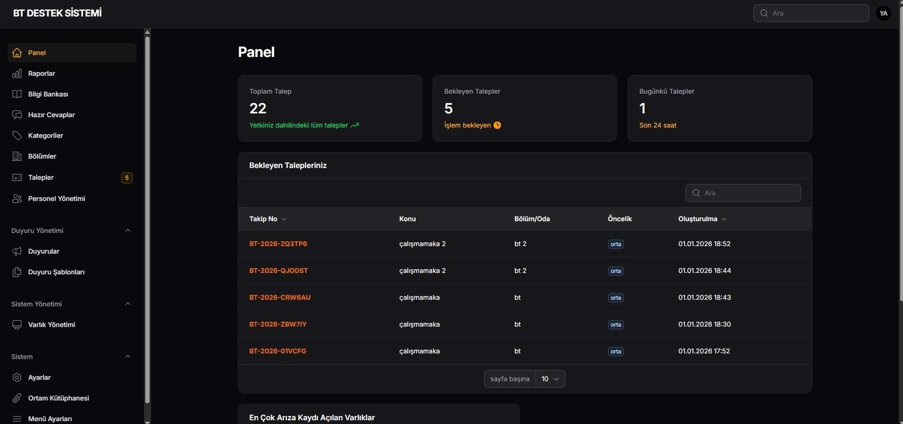
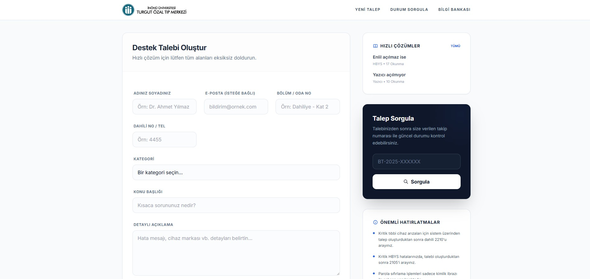

# 🏥 Hastane BT Destek Sistemi (Hospital IT Support)

Modern, hızlı ve kullanıcı dostu bir hastane Bilgi İşlem (BT) talep yönetim, envanter takip ve raporlama platformu.

Bu proje, hastane personelinin BT birimine sorunlarını en hızlı şekilde iletmesini sağlamak, BT teknisyenlerinin iş yükünü organize etmek ve kurum envanterini (bilgisayar, yazıcı vb.) dijital ortamda yönetmek amacıyla **Laravel 12** ve **Filament** kullanılarak geliştirilmiştir.





---

## 🚀 Öne Çıkan Özellikler

### 1. 🖱️ Personel Arayüzü (Public Portal)
Kullanıcı girişi gerektirmeyen, herkesin erişebileceği hızlı işlem merkezi.
*   **Hızlı Talep Oluşturma:** Ad, Bölüm, Kategori ve Açıklama ile saniyeler içinde arıza bildirimi.

*   **Talep Sorgulama:** Takip numarası (Örn: `#BT-2026-X8Y2`) ile anlık durum sorgulama (Bekliyor, İşlemde, Çözüldü).
*   **Duyuru Sistemi:** Kritik sistem kesintileri veya bilgilendirmeler için pop-up ve banner duyurular.
*   **Bilgi Bankası (KB):** Sık yaşanan sorunlar için resimli çözüm rehberleri (Self-Service).
*   **Dosya Yükleme:** Arıza ile ilgili ekran görüntüsü veya hata loglarını güvenli şekilde ekleme.

### 2. 🛠️ Yönetim Paneli (Admin & Teknisyen)
BT personelinin tüm süreci yönettiği güvenli alan.
*   **Dashboard & İstatistikler:** Anlık bekleyen talep sayıları, günlük yoğunluk grafikleri.
*   **Gelişmiş Raporlama:** 
    *   Hangi departmandan daha çok arıza geliyor? (Isı Haritası)
    *   En çok hangi kategori (Yazıcı, Ağ, HBYS) sorun çıkarıyor?
    *   Son 30 günlük talep trend analizi.
    *   Tüm raporları **Excel** formatında dışa aktarma.
*   **İş Emri Çıktısı (Yazdırılabilir Form):** Tamamlanan işler için üzerinde teknisyen ve personel imza alanları bulunan, kurumsal **PDF formatında İş Emri** oluşturma.
*   **Rol ve Yetki Yönetimi:** Admin ve Teknisyen ayrımı. Kategori bazlı yetkilendirme (Örn: Yazılım ekibi sadece Yazılım taleplerini görsün).

### 3. 📦 Envanter Yönetimi (ITAM)
Kurumdaki donanımların yaşam döngüsü takibi.
*   **Envanter Takibi:** Bilgisayar, Yazıcı, Monitör vb. cihazların kaydı.
*   **Detaylı Özellikler:** RAM, Disk, Model gibi teknik özelliklerin (JSON tabanlı esnek yapı) tutulması.
*   **Zimmet Takibi:** Cihazın hangi personelde veya hangi odada olduğunun takibi.
*   **Arıza Geçmişi:** Bir cihazın (Envanterin) detayına girildiğinde, o cihaza ait geçmişte açılmış tüm arıza kayıtlarının listelenmesi.
*   **Excel Import:** Mevcut envanter listelerinin toplu olarak içeri aktarılması.

### 4. 🔔 Bildirim ve Ayarlar
*   **E-Posta Bildirimleri:** Talep oluşturulduğunda, durumu değiştiğinde veya çözüldüğünde otomatik E-Posta gönderimi.
*   **SMTP Ayarları:** Kod dosyasına dokunmadan, yönetim panelinden SMTP sunucu bilgilerini (Host, Port, User, Pass) güncelleyebilme.
*   **Mesai Yönetimi:** Mesai saatleri dışında veya hafta sonlarında talep açılmasını engelleme opsiyonu.
*   **Site Ayarları:** Logo, Başlık, Favicon ve Önemli Hatırlatmalar metinlerinin panelden yönetimi.

---

## 🛠️ Teknik Altyapı (Tech Stack)

*   **Backend:** Laravel 12 (PHP 8.2+)
*   **Admin Panel:** FilamentPHP (TALL Stack)
*   **Frontend:** Blade, Livewire 3, Alpine.js, Tailwind CSS
*   **Veritabanı:** MySQL / MariaDB (SQLite destekli)
*   **Kuyruk Sistemi:** Database Queue (Asenkron işlemler ve Mail gönderimi için)
*   **PDF Motoru:** CSS tabanlı print view (Native tarayıcı desteği ile)

---

## ⚙️ Kurulum (Installation)

Projeyi yerel ortamınızda çalıştırmak için aşağıdaki adımları izleyin:

1.  **Depoyu Klonlayın:**
    ```bash
    git clone https://github.com/yusuf-aslan/BTDestek.git
    cd BTDestek
    ```

2.  **Bağımlılıkları Yükleyin:**
    ```bash
    composer install
    npm install
    ```

3.  **Çevre Ayarlarını Yapılandırın:**
    ```bash
    cp .env.example .env
    php artisan key:generate
    ```
    *.env dosyasındaki veritabanı ayarlarını yapmayı unutmayın.*

4.  **Veritabanını Hazırlayın:**
    ```bash
    php artisan migrate:fresh --seed
    ```
    *(Bu komut veritabanını oluşturur ve varsayılan Admin kullanıcısını ekler)*

5.  **Depolama Bağlantısını Kurun:**
    ```bash
    php artisan storage:link
    ```

6.  **Uygulamayı Başlatın:**
    ```bash
    npm run build
    php artisan serve
    ```

7.  **Giriş Bilgileri:**
    *   **Admin Paneli:** `/admin`
    *   **E-Posta:** `admin@btdestek.com`
    *   **Şifre:** `password`

---

## 🔄 Geliştirme Süreci (Changelog)

*   **v1.9 - Envanter Yönetimi ve Raporlama Geliştirmeleri:**
    *   **Terminoloji Güncellemesi:** Proje genelinde "Varlık" kelimesi "Envanter" olarak değiştirildi.
    *   **Saha Kaldırma:** Kullanılmayan `Demirbaş No`, `Seri Numarası`, `Zimmetli Personel` ve `Bilgisayar Adı` alanları sistemden kaldırıldı.
    *   **Envanter Sorgulama Geliştirmesi:** "Envanter Sorgulama" sayfasına model bazlı arama ve tüm bölümlerde arama yapma özelliği eklendi.
    *   **Çöp Kutusu (Soft Delete):** Envanter yönetimine, silinen kayıtların geri getirilebilmesi için "Çöp Kutusu" özelliği eklendi.
    *   **Yeni Alan: Arızalı PC IP:** Kullanıcıların, arızalı bir cihaz için ayrı bir IP adresi girebilmesi sağlandı.
    *   **Raporlama Arayüzü:** "Raporlar ve İstatistikler" sayfasının yerleşimi, tablonun üstte, grafiklerin altta olacak şekilde yeniden düzenlendi.
*   **v1.8 - Envanter Sorgulama & Raporlama:**
    *   **Envanter Sorgula (Asset Query):** "Envanter Yönetimi" altına, envanterleri "Ana Birim" ve "Model" bazlı filtreleyip listeleyebilen özel bir sorgulama sayfası eklendi.
    *   **Yazdır / PDF:** Filtrelenen envanter listesinin, kurumsal formatta yazdırılabilmesi veya PDF olarak kaydedilebilmesi için raporlama özelliği eklendi.
*   **v1.7 - İçe Aktarma & Arayüz İyileştirmeleri:**
    *   **Veri Aktarım Düzeltmesi:** "Bölüm - Birim Yönetimi" için Excel/CSV dosyalarını içe aktarma özelliği onarıldı. Dosya tipi doğrulaması ve Türkçe karakter kodlama sorunları giderildi.
    *   **Menü Yeniden Düzenlemesi:** "Envanter Yönetimi" ve "Bölüm - Birim Yönetimi" menüleri, daha tutarlı bir kullanıcı deneyimi için "Envanter Yönetimi" grubu altında birleştirildi.
*   **v1.6 - Kullanıcı Deneyimi & Çıktı Geliştirmeleri:**
    *   **PHP 8.4 Desteği:** Proje altyapısı PHP 8.4'e güncellendi.
    *   **Opsiyonel E-posta Alanı:** Talep formundaki e-posta alanı artık panelden isteğe bağlı olarak gösterilip gizlenebiliyor.
    *   **Talep Çıktısı & PDF:** Talep oluşturulduktan sonra kullanıcılar artık taleplerinin bir kopyasını yazdırabilir veya PDF olarak indirebilir.
    *   **Terminoloji Güncellemesi:** Kullanıcı arayüzünde "Takip Numarası" ifadesi, daha anlaşılır olan "Talep Numarası" olarak değiştirildi.
    *   **PDF Türkçe Karakter Desteği:** Oluşturulan PDF çıktılarındaki Türkçe karakter sorunu giderildi.
*   **v1.5 - Raporlama & Çıktı:** Gelişmiş grafiksel raporlar ve PDF iş emri çıktısı eklendi.
*   **v1.4 - Envanter Yönetimi:** ITAM modülü, cihaz takibi ve talep ilişkilendirme.
*   **v1.3 - Bildirimler:** SMTP entegrasyonu ve otomatik e-posta bildirimleri.
*   **v1.2 - Panel Ayarları:** Veritabanı tabanlı genel ayarlar ve SMTP konfigürasyonu.
*   **v1.0 - Çekirdek:** Talep toplama, KB ve Admin paneli.

---
**Lisans:** MIT License
