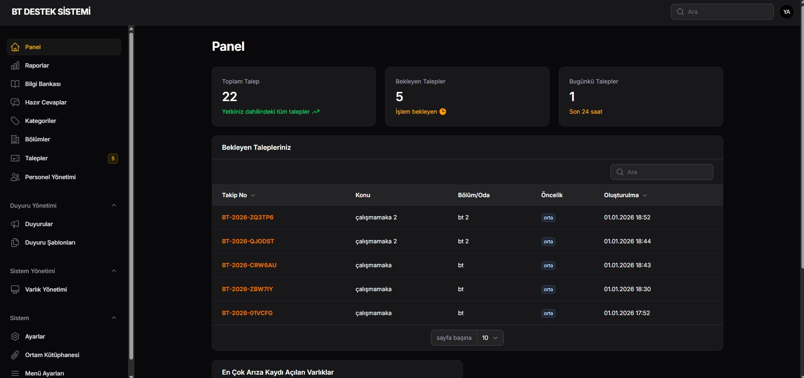
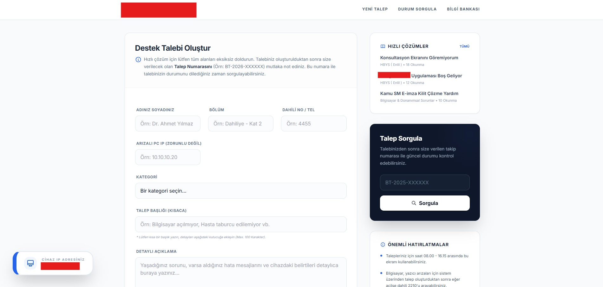

# 🏥 Hastane BT Destek Sistemi (Hospital IT Support)

Modern, hızlı ve kullanıcı dostu bir hastane Bilgi İşlem (BT) talep yönetim, envanter takip ve raporlama platformu.

Bu proje, hastane personelinin BT birimine sorunlarını en hızlı şekilde iletmesini sağlamak, BT teknisyenlerinin iş yükünü organize etmek ve kurum envanterini (bilgisayar, yazıcı vb.) dijital ortamda yönetmek amacıyla **Laravel 12** ve **Filament** kullanılarak geliştirilmiştir.





---

## 🚀 Öne Çıkan Özellikler

### 1. 🖱️ Personel Arayüzü (Public Portal)
Kullanıcı girişi gerektirmeyen, herkesin erişebileceği hızlı işlem merkezi.
*   **Hızlı Talep Oluşturma:** Ad, Bölüm, Kategori ve Açıklama ile saniyeler içinde arıza bildirimi.

*   **Talep Sorgulama:** Takip numarası (Örn: `#BT-2026-X8Y2`) ile anlık durum sorgulama (Bekliyor, İşlemde, Çözüldü).
*   **Duyuru Sistemi:** Kritik sistem kesintileri veya bilgilendirmeler için pop-up ve banner duyurular.
*   **Bilgi Bankası (KB):** Sık yaşanan sorunlar için resimli çözüm rehberleri (Self-Service).
*   **Dosya Yükleme:** Arıza ile ilgili ekran görüntüsü veya hata loglarını güvenli şekilde ekleme.

### 2. 🛠️ Yönetim Paneli (Admin & Teknisyen)
BT personelinin tüm süreci yönettiği güvenli alan.
*   **Dashboard & İstatistikler:** Anlık bekleyen talep sayıları, günlük yoğunluk grafikleri.
*   **Gelişmiş Raporlama:** 
    *   Hangi departmandan daha çok arıza geliyor? (Isı Haritası)
    *   En çok hangi kategori (Yazıcı, Ağ, HBYS) sorun çıkarıyor?
    *   Son 30 günlük talep trend analizi.
    *   Tüm raporları **Excel** formatında dışa aktarma.
*   **İş Emri Çıktısı (Yazdırılabilir Form):** Tamamlanan işler için üzerinde teknisyen ve personel imza alanları bulunan, kurumsal **PDF formatında İş Emri** oluşturma.
*   **Rol ve Yetki Yönetimi:** Admin ve Teknisyen ayrımı. Kategori bazlı yetkilendirme (Örn: Yazılım ekibi sadece Yazılım taleplerini görsün).

### 3. 📦 Envanter Yönetimi (ITAM)
Kurumdaki donanımların yaşam döngüsü takibi.
*   **Envanter Takibi:** Bilgisayar, Yazıcı, Monitör vb. cihazların kaydı.
*   **Detaylı Özellikler:** RAM, Disk, Model gibi teknik özelliklerin (JSON tabanlı esnek yapı) tutulması.
*   **Zimmet Takibi:** Cihazın hangi personelde veya hangi odada olduğunun takibi.
*   **Arıza Geçmişi:** Bir cihazın (Envanterin) detayına girildiğinde, o cihaza ait geçmişte açılmış tüm arıza kayıtlarının listelenmesi.
*   **Excel Import:** Mevcut envanter listelerinin toplu olarak içeri aktarılması.

### 4. 🔔 Bildirim ve Ayarlar
*   **E-Posta Bildirimleri:** Talep oluşturulduğunda, durumu değiştiğinde veya çözüldüğünde otomatik E-Posta gönderimi.
*   **SMTP Ayarları:** Kod dosyasına dokunmadan, yönetim panelinden SMTP sunucu bilgilerini (Host, Port, User, Pass) güncelleyebilme.
*   **Mesai Yönetimi:** Mesai saatleri dışında veya hafta sonlarında talep açılmasını engelleme opsiyonu.
*   **Site Ayarları:** Logo, Başlık, Favicon ve Önemli Hatırlatmalar metinlerinin panelden yönetimi.

---

## 🛠️ Teknik Altyapı (Tech Stack)

*   **Backend:** Laravel 12 (PHP 8.2+)
*   **Admin Panel:** FilamentPHP (TALL Stack)
*   **Frontend:** Blade, Livewire 3, Alpine.js, Tailwind CSS
*   **Veritabanı:** MySQL / MariaDB (SQLite destekli)
*   **Kuyruk Sistemi:** Database Queue (Asenkron işlemler ve Mail gönderimi için)
*   **PDF Motoru:** CSS tabanlı print view (Native tarayıcı desteği ile)

---

## ⚙️ Kurulum (Installation)

Projeyi yerel ortamınızda çalıştırmak için aşağıdaki adımları izleyin:

1.  **Depoyu Klonlayın:**
    ```bash
    git clone https://github.com/yusuf-aslan/BTDestek.git
    cd BTDestek
    ```

2.  **Bağımlılıkları Yükleyin:**
    ```bash
    composer install
    npm install
    ```

3.  **Çevre Ayarlarını Yapılandırın:**
    ```bash
    cp .env.example .env
    php artisan key:generate
    ```
    *.env dosyasındaki veritabanı ayarlarını yapmayı unutmayın.*

4.  **Veritabanını Hazırlayın:**
    ```bash
    php artisan migrate:fresh --seed
    ```
    *(Bu komut veritabanını oluşturur ve varsayılan Admin kullanıcısını ekler)*

5.  **Depolama Bağlantısını Kurun:**
    ```bash
    php artisan storage:link
    ```

6.  **Uygulamayı Başlatın:**
    ```bash
    npm run build
    php artisan serve
    ```

7.  **Giriş Bilgileri:**
    *   **Admin Paneli:** `/admin`
    *   **E-Posta:** `admin@btdestek.com`
    *   **Şifre:** `password`

---
## 🔄 Geliştirme Süreci (Changelog)

*   **v1.16 - Gelişmiş Raporlama, Faaliyet Yetkilendirme & Performans:**
    *   **Hızlı Faaliyet Modalı UI Düzeltmesi:** Modal içindeki alanlar arası boşluklar, textarea genişliği ve buton hizalaması düzeltildi. Tüm stiller Filament admin panel CSS uyumsuzluğunu aşmak için inline CSS'e dönüştürüldü.
    *   **Faaliyet Yetkilendirmesi:** `accessible_modules` listesine `Faaliyetlerim` seçeneği eklendi; admin olmayan teknisyenlere de bu modül yetkisi verilebilir hale getirildi.
    *   **Teknisyen Bazlı Gelişmiş Rapor Sayfası:** Raporlar sayfası tamamen yeniden tasarlandı. Teknisyen + tarih aralığı filtresi, 5 özet kart (Çözülen Talep, Atanan Talep, Ort. Çözüm Süresi, Faaliyet Sayısı, Toplam Faaliyet Süresi), iki sekme (Kapatılan Talepler + Faaliyetler) ve Excel export (iki ayrı sheet) eklendi.
    *   **Raporlar Karanlık Tema Desteği:** `<style>` bloğu + `.dark` CSS selector yöntemi ile her iki tema için tam uyum sağlandı.
    *   **Veritabanı Performans İndexleri:** `tickets` tablosuna 7 index, `activities` tablosuna 3 index eklenerek sorgu performansı önemli ölçüde artırıldı.
    *   **Ses Dosyası Yerelleştirildi:** TicketWatcher bildirimi için dış CDN yerine `public/sounds/notification.mp3` kullanılmaya başlandı.
    *   **Polling Optimizasyonu:** TicketWatcher kontrol aralığı 20sn → 30sn olarak güncellendi, sunucu yükü %33 azaltıldı.
    *   **Sistem Sürümü:** Footer alanındaki sürüm numarası v1.16'ya güncellendi.

*   **v1.15 - Faaliyet Yönetimi (IT Activity Log) Sistemi:**
    *   **Hızlı Faaliyet Ekleme Modalı:** BT personelinin bilet dışındaki plansız faaliyetlerini (saha çalışmaları, telefon destekleri, toplantılar) kolayca kaydedebilmesi için arayüzde üst bar (Header) kısmına "Hızlı Faaliyet Ekle" modalı entegre edildi.
    *   **Faaliyet Raporlama & Filtreleme:** Teknisyenlerin kendi faaliyetlerini takip edebileceği, yöneticilerin ise tüm faaliyetleri görüp tarih/teknisyen bazlı filtreleyebileceği ve Excel olarak dışa aktarabileceği "Faaliyetlerim" menüsü (Resource) oluşturuldu.
    *   **Sistem Sürümü:** Footer alanındaki sürüm numarası v1.15'e güncellendi.

*   **v1.14 - IP Tabanlı Talep Geçmişi ve Global Genişlik:**
    *   **IP Tabanlı Son 24 Saat Talep Geçmişi:** Kullanıcıların talep numaralarını unutma ihtimaline karşı sorgulama alanının üstünde, son 24 saat içinde o IP'den açılan biletleri listeleyen dinamik ve tek tıkla sorgulama sağlayan alan eklendi.
    *   **Global Genişlik & UI İyileştirmeleri:** Yönetim paneli genelinde varsayılan sayfa genişliği `screen-2xl` yapıldı. Talepler tablosunda satır eylemleri "İşlemler" dropdown butonu altında toplandı, Takip No sütunu varsayılan olarak gizlendi.
    *   **Sistem Sürümü:** Footer alanındaki sürüm numarası v1.14'e güncellendi.

*   **v1.13 - Akıllı Bildirimler, QR Kod ve UI Özelleştirme:**
    *   **Envanter QR Kod:** Tüm cihazlar için 80x50mm boyutlarında, detay sayfasına yönlendiren QR barkod yazdırma özelliği eklendi.
    *   **Dinamik Menü Yerleşimi:** Admin paneli için Yatay (Modern) ve Dikey (Klasik) menü seçenekleri getirildi.
    *   **Akıllı Bildirim Sistemi:** Yeni talep geldiğinde çalan "Sesli Uyarı" ve Talep Listesi'ndeyken otomatik sayfa yenileme (Auto-Refresh) özelliği eklendi.
    *   **Bilgi Bankası Etiketleri:** Makaleler için etiket (Tag) sistemi ve etiket bazlı arama/filtreleme özelliği eklendi.
    *   **Gelişmiş Formlar:** IP adresi kopyalama butonları, isteğe bağlı bölüm alanı ve daha geniş makale editörü ile kullanım kolaylığı sağlandı.
    *   **Menü Gruplandırma:** Admin paneli hiyerarşisi yeniden düzenlenerek sadeleştirildi.

*   **v1.12 - Kullanıcı Deneyimi ve Görünürlük Odaklı Güncellemeler:**
    *   **Geliştirilmiş Form Gönderim Butonu:** Talep gönder butonu, dikkat çekici Yeşil (Emerald) renge dönüştürüldü, boyutu büyütüldü ve üzerine hafif bir nabız (pulse) animasyonu eklendi. Ayrıca üzerine açıkça "(BURAYA TIKLAYIN)" ibaresi eklenerek fark edilebilirliği artırıldı.
    *   **Talep No Kopyalama:** Talep başarıyla oluşturulduktan sonra ekrana gelen takip numarasını tek tıkla panoya kopyalayan "Talep No Kopyala" butonu eklendi.
    *   **Kategori Bazlı Yetki Kısıtlaması (Admin Dahil):** Admin kullanıcıları dahi olsalar, eğer bir kategoriye atanmışlarsa sadece o kategorinin taleplerini görecek şekilde kısıtlandılar. Bu kısıtlama Dashboard (Bekleyen Talepler) ve yan menüdeki sayaçlara (badge) da yansıtıldı.
    *   **Akıllı Bekleme Süresi:** Taleplerin bekleme süresi artık 'çözüldü' veya 'iptal' durumuna geçtiğinde duruyor. Hesaplama `now()` yerine çözüm tarihini baz alacak şekilde düzeltildi.
    *   **Gelişmiş Form Alanları:** Admin panelindeki "Açıklama" ve "Çözüm Notu" alanları 10 satır yüksekliğine çıkarılarak daha geniş bir görüş alanı sağlandı.
    *   **Talep Kabul Saatleri Kontrolü:** "Mesai Saatleri" ifadesi "Talep Kabul Saatleri" olarak güncellendi. Kullanıcı formu doldurmaya başlamadan önce sistemin kapalı olup olmadığı kontrol ediliyor ve erken uyarı gösteriliyor.
    *   **Konu Başlığı Karakter Sınırı:** Konu başlığına 100 karakter sınırı getirildi ve tüm detayın başlığa yazılmasını engelleyen hem ön yüz hem arka yüz doğrulamaları eklendi.
    *   **Hızlı Kaydet:** Talep düzenleme sayfasının en üstüne "Değişiklikleri Kaydet" butonu eklendi.
    *   **Versiyon Bilgisi:** Footer alanına sistem versiyonu (v1.12) eklendi.

*   **v1.11 - Sistem Güvenliği ve Yedekleme:**

*   **v1.10 - Detaylı Envanter Yönetimi Geliştirmeleri:**
    *   **PDF Raporuna Teknik Özellikler:** Envanter sorgulama PDF raporuna RAM ve Monitör teknik özellikleri eklendi.
    *   **Cihaz Şablonlarına Marka Model:** Cihaz şablonlarına (DeviceTemplate) Marka Model alanı eklendi, böylece şablondan envanter oluşturulurken model bilgisi otomatik dolduruluyor.
    *   **Envanter Formu Şablon İyileştirmeleri:** Yeni envanter eklerken "Cihaz Şablonu Seçin" alanı artık sadece yeni kayıt oluştururken gösteriliyor ve var olan kayıtları düzenlerken gizleniyor.
    *   **Lokasyon Yönetimi Geliştirmeleri:** "Ana Birim" oluşturma formu, mevcut ana birimler arasından seçim yapmaya veya yeni bir ana birim eklemeye olanak tanıyan bir modal ile geliştirildi.
    *   **Envanter Listesi ve Sorgu Ekranında Teknik Özellik Tooltip'i:** "Tüm Envanterler" listesi ve "Envanter Sorgula" ekranında "Marka Model" üzerine gelindiğinde, RAM ve Monitör gibi teknik özellikler bir araç ipucu (tooltip) olarak gösteriliyor.
    *   **Envanter Formu Marka Model Girişi:** Envanter ekleme/düzenleme formundaki "Marka Model" alanı, artık herhangi bir değer girilmesine izin veren ve şablonlardan doldurulan modeller için doğrulama sorununu gideren bir metin giriş alanı olarak yapılandırıldı.

*   **v1.9 - Envanter Yönetimi ve Raporlama Geliştirmeleri:**
    *   **Terminoloji Güncellemesi:** Proje genelinde "Varlık" kelimesi "Envanter" olarak değiştirildi.
    *   **Saha Kaldırma:** Kullanılmayan `Demirbaş No`, `Seri Numarası`, `Zimmetli Personel` ve `Bilgisayar Adı` alanları sistemden kaldırıldı.
    *   **Envanter Sorgulama Geliştirmesi:** "Envanter Sorgulama" sayfasına model bazlı arama ve tüm bölümlerde arama yapma özelliği eklendi.
    *   **Çöp Kutusu (Soft Delete):** Envanter yönetimine, silinen kayıtların geri getirilebilmesi için "Çöp Kutusu" özelliği eklendi.
    *   **Yeni Alan: Arızalı PC IP:** Kullanıcıların, arızalı bir cihaz için ayrı bir IP adresi girebilmesi sağlandı.
    *   **Raporlama Arayüzü:** "Raporlar ve İstatistikler" sayfasının yerleşimi, tablonun üstte, grafiklerin altta olacak şekilde yeniden düzenlendi.
*   **v1.8 - Envanter Sorgulama & Raporlama:**
    *   **Envanter Sorgula (Asset Query):** "Envanter Yönetimi" altına, envanterleri "Ana Birim" ve "Model" bazlı filtreleyip listeleyebilen özel bir sorgulama sayfası eklendi.
    *   **Yazdır / PDF:** Filtrelenen envanter listesinin, kurumsal formatta yazdırılabilmesi veya PDF olarak kaydedilebilmesi için raporlama özelliği eklendi.
*   **v1.7 - İçe Aktarma & Arayüz İyileştirmeleri:**
    *   **Veri Aktarım Düzeltmesi:** "Bölüm - Birim Yönetimi" için Excel/CSV dosyalarını içe aktarma özelliği onarıldı. Dosya tipi doğrulaması ve Türkçe karakter kodlama sorunları giderildi.
    *   **Menü Yeniden Düzenlemesi:** "Envanter Yönetimi" ve "Bölüm - Birim Yönetimi" menüleri, daha tutarlı bir kullanıcı deneyimi için "Envanter Yönetimi" grubu altında birleştirildi.
*   **v1.6 - Kullanıcı Deneyimi & Çıktı Geliştirmeleri:**
    *   **PHP 8.4 Desteği:** Proje altyapısı PHP 8.4'e güncellendi.
    *   **Opsiyonel E-posta Alanı:** Talep formundaki e-posta alanı artık panelden isteğe bağlı olarak gösterilip gizlenebiliyor.
    *   **Talep Çıktısı & PDF:** Talep oluşturulduktan sonra kullanıcılar artık taleplerinin bir kopyasını yazdırabilir veya PDF olarak indirebilir.
    *   **Terminoloji Güncellemesi:** Kullanıcı arayüzünde "Takip Numarası" ifadesi, daha anlaşılır olan "Talep Numarası" olarak değiştirildi.
    *   **PDF Türkçe Karakter Desteği:** Oluşturulan PDF çıktılarındaki Türkçe karakter sorunu giderildi.
*   **v1.5 - Raporlama & Çıktı:** Gelişmiş grafiksel raporlar ve PDF iş emri çıktısı eklendi.
*   **v1.4 - Envanter Yönetimi:** ITAM modülü, cihaz takibi ve talep ilişkilendirme.
*   **v1.3 - Bildirimler:** SMTP entegrasyonu ve otomatik e-posta bildirimleri.
*   **v1.2 - Panel Ayarları:** Veritabanı tabanlı genel ayarlar ve SMTP konfigürasyonu.
*   **v1.0 - Çekirdek:** Talep toplama, KB ve Admin paneli.

---
**Lisans:** MIT License
